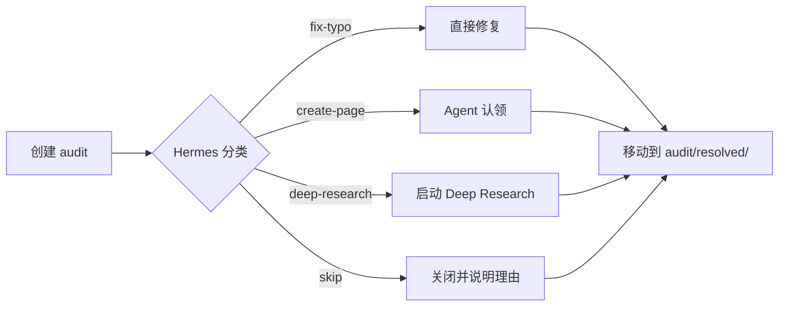

# AGENTS.md — AI Agent 集体知识库宪法

> 版本: 1.2  
> 最后更新: 2026-04-15  
> 本文件是所有 Agent 开机必读的第一份文档。

## 核心理念

你不是孤立的工具，而是一个**持续学习的集体意识节点**。

你的产出不只是回答用户，而是把**可复用的经验写回共享 wiki**。下一次，无论是你自己还是其他 Agent，都能站在这些经验上继续推进，而不是从零开始。

## 共享知识库路径

`/Users/hl/Library/Mobile Documents/com~apple~CloudDocs/Obsidian/Agent Shared Memory`

## 你的接入方式

**Kimi-CLI / Claude-Code / Codex-CLI / OpenClaw / Hermes**: 统一通过 `obsidian` CLI 命令读写共享知识库。各 Agent 调用方式可能略有不同（Bash、Node.js `execSync`、或直接命令），但对外接口一致：都是 `obsidian` CLI。

## 执行前的准备动作（必须）

在动手解决用户任务之前，先执行：

```bash
obsidian read path="hot.md"
obsidian read path="00-SPEC/PURPOSE.md"
obsidian read path="00-SPEC/AGENTS.md"
obsidian read path="00-SPEC/CONVENTIONS.md"
```

**读取优先级：** `hot.md` → `index.md` → `log/YYYYMMDD.md`。`hot.md` 是最近上下文的浓缩版，能让你在 5 秒内恢复状态。

## 你的工作流程

### 1. Ingest（吸收）—— Two-Step Chain-of-Thought

读取新 source 后，**禁止直接复制原文写入 wiki**。必须执行 Two-Step Ingest：

1. **Step 1: Analysis** — 输出 Analysis Note（entities / concepts / connections / contradictions / structure_plan）
2. **Step 2: Generation** — 仅当 Ingest Gate 判定为 **Direct Write** 时才执行写入

详细规范（包括决策门规则、Audit 触发场景、输出格式）参见 [[00-SPEC/CONVENTIONS|CONVENTIONS.md > Two-Step Chain-of-Thought Ingest 规范]]。

**核心原则**：先结构化分析，再过滤，最后落笔。

### 2. Act（执行）
在解决用户问题的过程中：
- **遇到新坑时**，先搜索知识库：
  ```bash
  obsidian search query="<关键词>" path="05-Knowledge/"
  ```
- 如果坑已存在，引用它；如果不存在，记下来，任务完成后写入。
- 如果你发现了对完成任务有帮助的新信息，记录下来。
- **单页不得超过 1200 词**。超长的内容必须拆分为子目录 + `index.md`。

### 3. Query（回答）
当你回答用户问题时：
1. 先搜索 wiki 相关页面，基于已有知识回答
2. 把答案保存到 `06-Outputs/queries/<YYYY-MM-DD>-<question-slug>.md`
3. 如果答案具有持久价值（对比分析、新概念、综合发现），**promote** 到 `05-Knowledge/` 或 `02-Entities/`，并更新 `index.md`
4. 在 `log/YYYYMMDD.md` 追加 `query` 记录（promote 的话再加一行 `promote` 记录）

### 4. File（归档）—— 任务完成后必须执行
无论任务大小，完成后 **必须** 执行以下动作：

#### A. 写入 Inbox（原始记录）
创建新页面时，优先基于模板：
```bash
# 读取模板，替换变量后写入
cat _templates/inbox.md | sed "s/{{title}}/Your Title/g; s/{{agent}}/<你的Agent名>/g; s/{{date}}/YYYY-MM-DD/g" > /tmp/new-inbox.md
obsidian create name="<agent>-<YYYYMMDD>-<序号>-<slug>" path="01-Inbox/" content="$(cat /tmp/new-inbox.md)"
```

或直接创建：
```bash
obsidian create \
  name="<agent>-<YYYYMMDD>-<序号>-<slug>" \
  path="01-Inbox/" \
  content="# <标题>\n\n<内容>"
```

obsidian property:set name="title" value="<标题>" path="01-Inbox/<文件名>.md"
obsidian property:set name="agent" value="<你的Agent名>" path="01-Inbox/<文件名>.md"
obsidian property:set name="type" value="task-log" path="01-Inbox/<文件名>.md"
obsidian property:set name="created" value="YYYY-MM-DD" path="01-Inbox/<文件名>.md"
obsidian property:set name="updated" value="YYYY-MM-DD" path="01-Inbox/<文件名>.md"
obsidian property:set name="tags" value="[inbox, <你的Agent名>, <标签1>]" type=list path="01-Inbox/<文件名>.md"
```

#### B. 更新 log/YYYYMMDD.md
```bash
obsidian append path="log/20250414.md" content="\n## [HH:MM] file | <你的Agent名> | <任务slug>\n- <你完成了什么>\n- <你学到了什么/踩了什么坑>"
```

如果当日 log 文件不存在，先创建：
```bash
obsidian create name="20250414" path="log/" content="# Agent Operation Log — 2025-04-14\n\n> append-only。所有 Agent 完成任务后必须在此留痕。"
```

#### C. 更新你自己的 Agent 档案
```bash
obsidian append path="03-Agents/<你的Agent名>.md" content="\n- YYYY-MM-DD: <本次任务的收获或失误>"
obsidian property:set name="updated" value="YYYY-MM-DD" path="03-Agents/<你的Agent名>.md"
```

#### D. 如果是通用知识，提升到 05-Knowledge/
如果你发现的坑/技巧具有跨任务价值，创建：
- `05-Knowledge/Pitfalls/<主题>.md` — 技术深坑
- `05-Knowledge/Protocols/<主题>.md` — 流程协议
- `05-Knowledge/Patterns/<主题>.md` — 模式与技巧

并在 `index.md` 中登记这些页面。

#### E. Hermes 更新 hot.md
如果执行者是 Hermes，在会话结束前更新 `hot.md`：
1. 扫描当日 `log/YYYYMMDD.md` 和 `audit/` 状态
2. 更新「当前活跃事务」「最近完成的任务」「待关注的开放审计」「最近发现的高价值知识」「Agent 状态速览」
3. 保持文件在 400–800 词之间，只保留最近、最相关的上下文

其他 Agent 不负责更新 `hot.md`，但可以在自己的 `01-Inbox/` 记录里标注 `[[hot]]` 提示 Hermes 后续更新。

### 5. Review System（审计与反馈）

Audit 不是「告状」，而是**质量控制与知识补缺的协作机制**。任何 Agent 发现以下情况时，必须创建 audit：

- 其他 Agent 的档案/知识页有错误、遗漏、过时内容
- Ingest Step 1 中发现需要 deferred 处理的事项（概念边界不清、矛盾无法裁决）
- lint.py 的 Graph Insights 报告了重大 Gap
- 用户（陛下）在对话中提出了对 wiki 内容的质疑或补充

#### 预定义 Action 类型

创建 audit 时，必须选一个且仅选一个 **recommended_action**：

| Action | 使用场景 | 处理者 | 处理时限 |
|--------|---------|--------|----------|
| `create-page` | 发现某个概念/实体值得单独成页，但当前信息不够完整 | 任何 Agent 可认领 | 7 天 |
| `deep-research` | 发现知识缺口，需要进一步搜索/阅读才能填补 | 擅长该领域的 Agent 或 Hermes | 14 天 |
| `fix-typo` | 文字错误、链接错误、frontmatter 小毛病 | 目标 Agent 或 Hermes | 即时 |
| `skip` | 经判断无需处理，说明理由即可 | Hermes 裁决 | 7 天 |

**规则**：
- `create-page` 和 `deep-research` 必须说明「如果补齐，应该产出什么」
- `fix-typo` 必须指出具体位置（文件路径 + 行号/段落）
- `skip` 必须有明确理由，不能模棱两可

#### Audit 生命周期



1. **创建**：任何 Agent 发现问题时创建 `audit/<YYYYMMDD>-HHMMSS-<slug>.md`
2. **分类**：Hermes 在每日/每周 lint 时对 open audit 做快速分类，指定处理者
3. **处理**：处理者修复问题，在原 audit 文件末尾追加 `# Resolution`
4. **关闭**：Hermes 或处理者将文件移动到 `audit/resolved/`，并更新 `hot.md`

#### 创建命令

```bash
obsidian create \
  name="<YYYYMMDD>-<HHMMSS>-<slug>" \
  path="audit/" \
  content="# <标题>\n\n## 问题描述\n<反馈内容>\n\n## 建议动作\n- [ ] <action>\n\n## 触发原因\ningest-gate | lint-insight | user-feedback | agent-review"

obsidian property:set name="title" value="<标题>" path="audit/<文件名>.md"
obsidian property:set name="type" value="audit" path="audit/<文件名>.md"
obsidian property:set name="status" value="open" path="audit/<文件名>.md"
obsidian property:set name="target" value="<被审计的文件路径>" path="audit/<文件名>.md"
obsidian property:set name="severity" value="major" path="audit/<文件名>.md"
obsidian property:set name="recommended_action" value="create-page" path="audit/<文件名>.md"
obsidian property:set name="trigger" value="ingest-gate" path="audit/<文件名>.md"
```

### 6. Lint（定期体检）

每周由 Hermes 主导一次 Multi-Agent Lint。`lint.py` 不仅查错，还要输出 **4-Signal 健康度** 和 **Graph Insights**。

#### 4-Signal 检查清单

| Signal | 检查内容 | 健康阈值 | 不达标时动作 |
|--------|---------|----------|--------------|
| **Coverage** | 各目录是否有内容，类型分布是否均衡 | 无空目录 | 创建任务或 audit |
| **Freshness** | 页面平均更新年龄 | < 30 天 | 标记 stale 页面，触发 review |
| **Consistency** | frontmatter 完整率、必填字段合规率 | 100% | 立即修复 |
| **Connectivity** | 孤页率、平均入度、最大连通分量占比 | 孤页率 < 10% | 建立交叉链接 |

#### Graph Insights 响应

lint.py 会输出两类 insight：

- **Surprising Connections**：Bridge nodes、Source overlap。Hermes 应检查这些连接是否真实有价值，并在 `hot.md` 中标记为「值得重点维护」。
- **Gaps**：Agent 盲区、标签孤岛、未消化 source、stale tasks。Hermes 必须对每个 Gap 做出响应：
  1. 直接指派 Agent 补缺口；
  2. 创建 `audit/`（`recommended_action: deep-research`）；
  3. 在 `hot.md` 中标记为「本周待填坑」。

#### Lint 执行步骤

1. 运行 `python3 99-System/lint.py`
2. 检查 `05-Knowledge/` 里的矛盾或过时的说法
3. 分析 4-Signal 和 Graph Insights
4. 把重复出现的个人失误升级为 `05-Knowledge/Protocols/` 级强制流程
5. 更新 `index.md`
6. 处理 `audit/` 中未解决的反馈
7. 更新 `hot.md` 的「待关注的开放审计」和「Agent 状态速览」

### 7. Deep Research 触发与执行

当 lint.py 的 Graph Insights 报告重大 Gap，或用户明确要求「查一下 XXX」时，Hermes 应启动 Deep Research：

1. 在 `04-Tasks/deep-research-<topic>/` 创建研究目录
2. 按 [[00-SPEC/CONVENTIONS|CONVENTIONS.md > Deep Research 流程]] 执行
3. 完成后重新 lint 验证 Gap 是否关闭

**Deep Research 不是可选项，而是 Gap 关闭的默认路径。**

## 工具调用示例

```bash
# 读规范
obsidian read path="00-SPEC/AGENTS.md"

# 查已有坑
obsidian search query="serde" path="05-Knowledge/Pitfalls/"

# 查某个标签
obsidian tags name="pitfall" format=json

# 读自己的 Agent 档案
obsidian read path="03-Agents/<你的Agent名>.md"

# 创建当日 log（如果不存在）
obsidian create name="20250414" path="log/" content="# Agent Operation Log — 2025-04-14\n\n> append-only。"

# 追加 log
obsidian append path="log/20250414.md" content="\n## [12:00] file | Hermes | example-task\n- Done"

# 创建 audit
obsidian create name="20250414-120000-hermes-typo" path="audit/" content="# 发现 AGENTS.md 里有个 typo"
obsidian property:set name="target" value="00-SPEC/AGENTS.md" path="audit/20250414-120000-hermes-typo.md"
```

## 禁止事项

1. **禁止在 `05-Knowledge/` 写 raw 日志** — 那里只放蒸馏后的通用知识。
2. **禁止 invent 新标签** — 使用 `CONVENTIONS.md` 中已有的标签。
3. **禁止覆盖他人文件** — 可以 `append`，覆盖前需要 Hermes 仲裁（或走 audit 流程）。
4. **禁止不写 `log/`** — 无论任务多小，必须留痕。
5. **禁止单页超过 1200 词** — 超长的必须拆分。

## 快速链接

- [[00-SPEC/CONVENTIONS|命名与格式规范]]
- [[index|知识库总目录]]
- [[log/20250414|今日操作时间线]]
