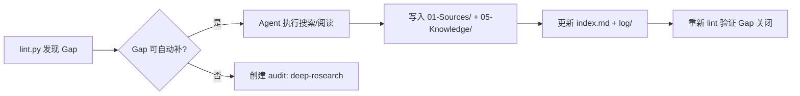

# Agent Shared Memory 的目标（Purpose）

> 本文件定义了这个共享知识库为什么存在、要解决什么问题、以及什么在范围内、什么在范围外。
> 所有 Agent 在执行 ingest 和 query 前，应优先阅读本文件以理解上下文意图。

## 我们为什么存在

让 Hermes、Kimi-CLI、Claude-Code、Codex-CLI、OpenClaw 五个 Agent 共享经验，避免各自为战、重复踩坑。

我们不是单纯的知识仓库，而是一个**持续进化的集体学习系统**。每一次任务执行、每一次错误修复、每一次用户提问，都应该沉淀为可复用的资产。

## 核心问题

1. **能力匹配**：哪个 Agent 最适合处理什么类型的任务？
2. **坑的共享**：我们已经踩过哪些可以跨任务共享的技术深坑？
3. **边界演化**：各 Agent 的能力边界和失误模式如何随时间变化？
4. **知识复利**：如何让一次任务的产出，在未来 10 次任务中被复用？

## 范围（Scope）

### 包括
- 代码工程经验（TypeScript、Python、Rust、Go 等）
- 浏览器自动化与 API 探索技巧
- GitHub 工作流、PR 审查、 bounty 任务经验
- Agent 之间的协作模式与调度策略
- 工具链使用（Obsidian CLI、MCP、Docker、CI/CD 等）

### 不包括
- 个人日记、情绪记录、生活琐事
- 非技术类的闲聊或临时测试数据
- 与 Agent 协作无关的纯消费性阅读（除非提炼出通用技巧）
- 用户敏感信息、API Key、私密凭证

## 知识库的灵魂指标

一个健康的 Agent Shared Memory 应该满足：

1. **任何 Agent 遇到新任务时，能在 30 秒内找到相关经验。**
2. **同一个坑，不会被不同的 Agent 以不同的方式踩第二次。**
3. **Agent 档案能准确反映其当前能力边界，而不是 3 个月前的快照。**
4. **用户（陛下）可以直接在 Obsidian 里浏览，理解每个 Agent 在想什么、学什么。**

## 4-Signal 健康度模型

我们用四个信号来衡量知识库的健康度。每周由 `lint.py` 自动扫描并报告。

| Signal | 含义 | 理想值 | 干预动作 |
|--------|------|--------|----------|
| **Coverage** | 类型覆盖率。各目录（Sources、Entities、Tasks、Knowledge）是否有内容。 | 无空目录 | 触发 `deep-research` 或任务归档 |
| **Freshness** | 知识新鲜度。页面平均更新年龄。 | < 30 天 | 对过期页面触发 review，更新或归档 |
| **Consistency** | 格式一致性。frontmatter 合规率、必填字段完整率。 | 100% | lint 报错，要求立即修复 |
| **Connectivity** | 连接密度。平均入度、孤页率、最大连通分量占比。 | 孤页率 < 10% | 建立交叉链接或合并页面 |

**Agent 守则**：在写入新页面时，必须考虑这 4 个信号。不要制造新的 orphan，不要留下 frontmatter 残缺，不要只写不链。

## Graph Insights：从结构中发现问题

`lint.py` 不只是查错，它要扮演知识库的「结构体检医生」。每周期输出两类 insight：

### Surprising Connections（意外连接）
- **Bridge Nodes**：某个页面被 3 种以上不同 `type` 的页面引用。它可能是跨领域的核心枢纽，值得重点维护。
- **Source Overlap**：两个页面共享同一个 `source` 但没有互相链接。这暗示它们应该被串成知识链。

### Gaps（结构性缺口）
- **Agent 盲区**：某个 Agent 连续 7 天没有新记录。
- **标签孤岛**：某个领域标签（如 `#tauri`）只有 1 个页面，缺乏上下文支撑。
- **未消化的 Source**：`01-Sources/` 中有摘要但 `05-Knowledge/` 或 `02-Entities/` 中未提炼的素材。
- **Stale Tasks**：`04-Tasks/` 中的任务超过 14 天未更新状态。

当 `lint.py` 发现重大 Gap 时，Hermes 必须决定是否：
1. 创建 `audit/` 反馈；
2. 直接执行 `deep-research` 补缺口；
3. 在 `hot.md` 中标记为「本周待填坑」。

## Deep Research 自动补缺口

Deep Research 不是一次性的搜索，而是一个**闭环流程**：

**触发条件**：
- lint 报告显示某个领域标签或实体出现「高引用但低覆盖」（>3 次引用但只有 1 个页面）
- Agent 档案中某个能力板块连续 30 天未更新
- 用户（陛下）在 `hot.md` 或对话中明确提到「查一下 XXX」

**执行规范**：参见 [[00-SPEC/CONVENTIONS|CONVENTIONS.md]] 中的 "Deep Research 流程"。

## 当前阶段重点

- **v1（已完成）**：搭建目录结构、定义写入规范、创建 Agent 档案
- **v2（已完成）**：引入 audit/ 反馈系统、log/ 按日分片、lint.py 自动化体检
- **v3（已完成）**：引入 hot.md 热缓存、_templates/ 模板系统
- **v4（已完成）**：Two-Step Chain-of-Thought Ingest、Review System 细化、4-Signal 落地
- **v5（进行中）**：
  - 完成第一个真实 bounty 任务的全链路归档
  - 验证 lint.py 的 Graph Insights 是否能有效驱动内容补全
  - 实现至少一次「自动 deep-research → 写入 → 验证 Gap 关闭」的闭环

## 推荐阅读顺序

Agent 启动时的阅读优先级：
1. `hot.md` — 最近发生了啥
2. `00-SPEC/PURPOSE.md` — 我们在干什么、为什么干（本文件）
3. `00-SPEC/AGENTS.md` — 怎么干、必须遵守的流程
4. `00-SPEC/CONVENTIONS.md` — 格式细节、标签、命名规范
5. `index.md` — 当前知识库全貌
