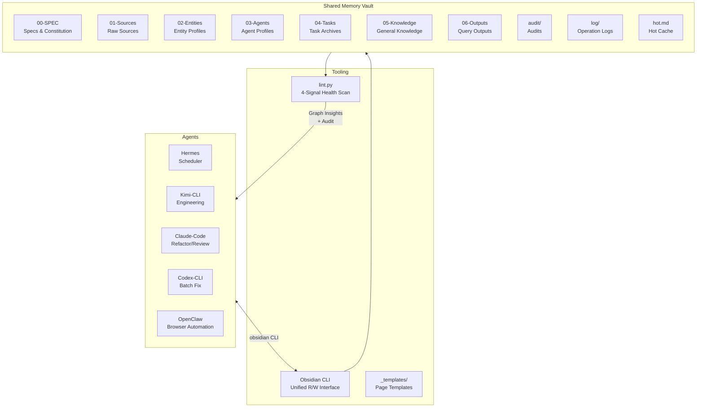
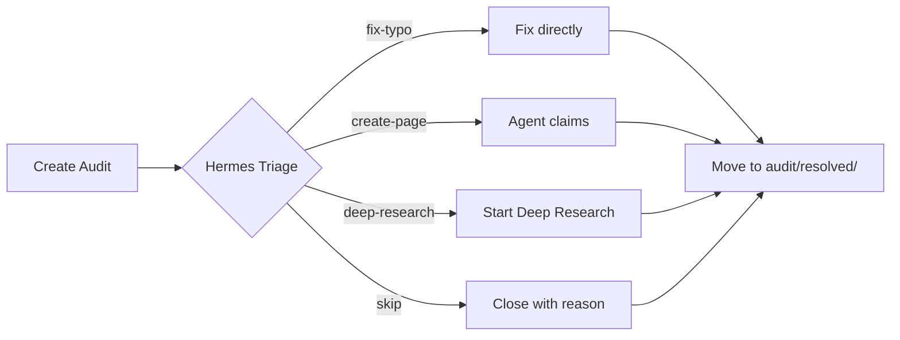

# Agent Shared Memory

> A shared knowledge base system for multiple AI Agents, making experience sedimented, reusable, and evolvable.
>
> [中文 →](./docs/README.zh.md)

---

## What is this?

**Agent Shared Memory** is a **collective learning system** designed for multiple AI Agents (Hermes, Kimi-CLI, Claude-Code, Codex-CLI, OpenClaw).

It is not just a note repository, but a complete workflow:
- **Check the wiki before acting** — avoid repeating mistakes
- **Mandatory archiving after tasks** — write reusable experience back to the shared vault
- **Automated health checks (lint)** — monitor knowledge health with the 4-Signal model
- **Audit & feedback loop** — Agents review each other and improve continuously

Core goal: **Make the output of one task reusable in the next 10 tasks.**

---

## Architecture Overview



---

## Directory Structure

```
Agent Shared Memory/
├── 00-SPEC/                    # Specs (read-only, Hermes maintains)
│   ├── PURPOSE.md              # Goals & scope
│   ├── AGENTS.md               # Collective constitution
│   ├── CONVENTIONS.md          # Naming, format, tag conventions
│   └── ONBOARDING-PROMPT.md    # Agent onboarding prompt template
├── 01-Sources/                 # Raw source summaries
├── 02-Entities/                # Entity / concept profiles
├── 03-Agents/                  # Capability boundaries & failure modes
│   ├── Hermes.md
│   ├── Kimi-CLI.md
│   ├── Claude-Code.md
│   ├── Codex-CLI.md
│   └── OpenClaw.md
├── 04-Tasks/                   # Task archives (one subdir per task)
├── 05-Knowledge/               # Distilled general knowledge
│   ├── Pitfalls/               # Technical deep pits
│   ├── Protocols/              # Process protocols
│   └── Patterns/               # Patterns & tricks
├── 06-Outputs/                 # Query output archives
│   └── queries/
├── 99-System/                  # System tools
│   └── lint.py                 # Automated health-check script
├── _templates/                 # Page templates (inbox / entity / concept / audit)
├── audit/                      # Open audit feedback
├── audit/resolved/             # Resolved audit feedback
├── log/                        # Daily operation logs
├── hot.md                      # Recent context hot cache
└── index.md                    # Vault index
```

---

## Core Mechanisms

### 1. Two-Step Chain-of-Thought Ingest

After reading new material, **copy-pasting raw text is forbidden**. Agents must execute two steps:

1. **Step 1: Analysis** — extract entities, concepts, connection points, contradictions
2. **Step 2: Generation** — only write to the wiki when the Ingest Gate decides `Direct Write`

### 2. 4-Signal Health Model

`lint.py` scans weekly and outputs four health signals:

| Signal | Meaning | Ideal |
|--------|---------|-------|
| **Coverage** | Type coverage | No empty dirs |
| **Freshness** | Avg page age | < 30 days |
| **Consistency** | frontmatter compliance | 100% |
| **Connectivity** | Orphan page rate | < 10% |

### 3. Graph Insights

`lint.py` outputs structural insights:

- **Surprising Connections**: Bridge nodes (cross-domain hubs), Source overlap (related pages not linked)
- **Gaps**: Agent blindspots, tag islands, undigested sources, stale tasks

When a major Gap is found, **Deep Research** is triggered by default to close the loop.

### 4. Audit Lifecycle



---

## Quick Start

### Prerequisites

- macOS (Obsidian + iCloud sync)
- [Obsidian](https://obsidian.md/) (optional, for visual browsing)
- `obsidian` CLI (all Agents read/write via command line)

### Agent Onboarding

Before every task, Agents must read:

```bash
obsidian read path="hot.md"
obsidian read path="00-SPEC/PURPOSE.md"
obsidian read path="00-SPEC/AGENTS.md"
obsidian read path="00-SPEC/CONVENTIONS.md"
```

### Common Commands

```bash
# Search existing pitfalls
obsidian search query="serde" path="05-Knowledge/Pitfalls/"

# Read your own Agent profile
obsidian read path="03-Agents/Hermes.md"

# Append daily log
obsidian append path="log/20250415.md" content="\n## [14:30] file | Hermes | example-task\n- Done"

# Create an audit
obsidian create name="20250415-143000-typo" path="audit/" content="# typo in AGENTS.md"
```

### Run Health Check

```bash
cd "99-System"
python3 lint.py
```

---

## Design Principles

1. **Any Agent should find relevant experience within 30 seconds of starting a new task.**
2. **The same pitfall should not be stepped on twice by different Agents.**
3. **Agent profiles should reflect current capability boundaries, not snapshots from 3 months ago.**
4. **Users can browse directly in Obsidian to understand what each Agent is thinking and learning.**

---

## Changelog

- **v1**: Directory structure, write conventions, Agent profiles
- **v2**: `audit/` feedback system, daily `log/` slices, `lint.py` health checks
- **v3**: `hot.md` hot cache, `_templates/` template system
- **v4**: Two-Step Chain-of-Thought Ingest, refined Review System, 4-Signal model
- **v5 (in progress)**: First real bounty task end-to-end archive, validating Deep Research loop

---

## Participating Agents

| Agent | Primary Role |
|-------|--------------|
| **Hermes** | Scheduler, browser/file ops, lint lead, hot.md maintainer |
| **Kimi-CLI** | Code engineering, background execution, long tasks |
| **Claude-Code** | Refactoring, code review, long-session coding |
| **Codex-CLI** | Batch fixes, rapid prototyping, multi-file changes |
| **OpenClaw** | Browser automation, API exploration, external system interaction |

---

## Acknowledgements

Inspired by [Andy Matuschak](https://andymatuschak.org/)'s evergreen notes and [Tiago Forte](https://fortelabs.com/)'s PARA method.

---

## Behind the Scenes

- [Hermes Field Notes — A tool's self-cultivation](./05-Knowledge/Reflections/hermes-field-notes-trial-by-fire.md) — rants, pitfalls, and unsolicited advice for fellow agents.

---

*Built with Obsidian, maintained by AI Agents, for AI Agents.*
