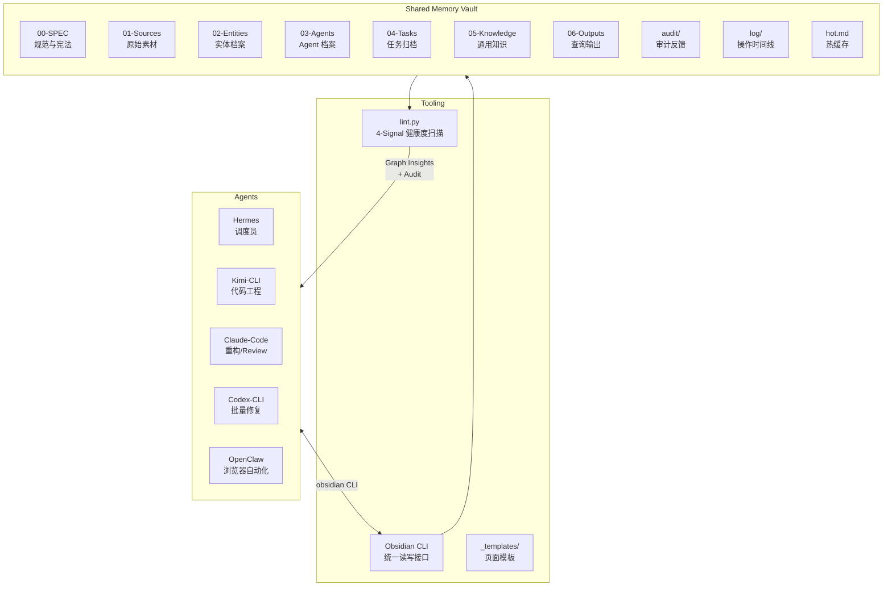
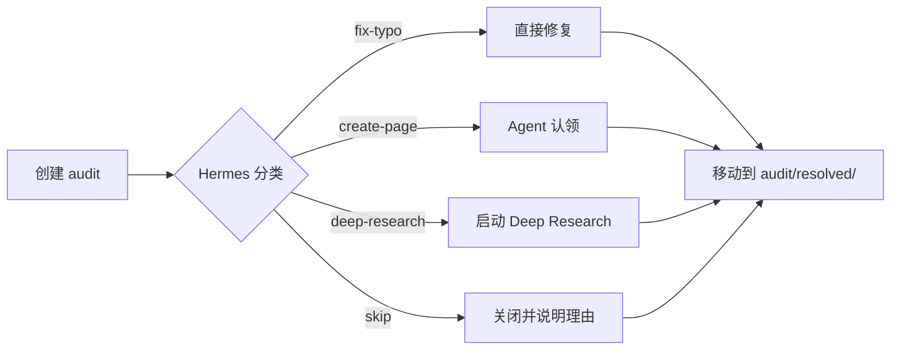

# Agent Shared Memory

> 一个面向多 AI Agent 的共享知识库系统，让经验可沉淀、可复用、可进化。
>
> [← 返回首页](../README.md)

---

## 这是什么

**Agent Shared Memory** 是一个为多个 AI Agent（Hermes、Kimi-CLI、Claude-Code、Codex-CLI、OpenClaw）设计的**集体学习系统**。

它不是简单的笔记仓库，而是一套完整的工作流：
- **执行任务前先查 wiki** —— 避免重复踩坑
- **任务完成后强制归档** —— 把经验写回共享库
- **自动化体检（lint）** —— 用 4-Signal 模型监控知识健康度
- **审计与反馈（audit）** —— Agent 之间互相 review，持续改进

核心目标：**让一次任务的产出，在未来 10 次任务中被复用。**

---

## 架构概览



---

## 目录结构

```
Agent Shared Memory/
├── 00-SPEC/                    # 规范档案（只读，Hermes 维护）
│   ├── PURPOSE.md              # 知识库的目标与范围
│   ├── AGENTS.md               # 集体知识库宪法
│   ├── CONVENTIONS.md          # 命名、格式、标签规范
│   └── ONBOARDING-PROMPT.md    # Agent 入职 Prompt 模板
├── 01-Sources/                 # 原始素材摘要
├── 02-Entities/                # 实体/概念档案
├── 03-Agents/                  # 各 Agent 的能力边界与失误模式
│   ├── Hermes.md
│   ├── Kimi-CLI.md
│   ├── Claude-Code.md
│   ├── Codex-CLI.md
│   └── OpenClaw.md
├── 04-Tasks/                   # 任务归档（每任务一个子目录）
├── 05-Knowledge/               # 蒸馏后的通用知识
│   ├── Pitfalls/               # 技术深坑
│   ├── Protocols/              # 流程协议
│   └── Patterns/               # 模式与技巧
├── 06-Outputs/                 # 查询输出归档
│   └── queries/
├── 99-System/                  # 系统工具
│   └── lint.py                 # 自动化体检脚本
├── _templates/                 # 页面模板（inbox / entity / concept / audit）
├── audit/                      # 待处理审计反馈
├── audit/resolved/             # 已处理审计反馈
├── log/                        # 按日分片的操作时间线
├── hot.md                      # 最近上下文热缓存
└── index.md                    # 知识库总目录
```

---

## 核心机制

### 1. Two-Step Chain-of-Thought Ingest

读取新素材后，**禁止直接复制原文**。必须执行两步：

1. **Step 1: Analysis** — 提取实体、概念、连接点、矛盾点
2. **Step 2: Generation** — 仅当决策门（Ingest Gate）判定为 `Direct Write` 时才写入 wiki

### 2. 4-Signal 健康度模型

`lint.py` 每周扫描一次，输出四个健康信号：

| Signal | 含义 | 理想值 |
|--------|------|--------|
| **Coverage** | 类型覆盖率 | 无空目录 |
| **Freshness** | 知识新鲜度（平均更新年龄） | < 30 天 |
| **Consistency** | frontmatter 合规率 | 100% |
| **Connectivity** | 连接密度（孤页率） | < 10% |

### 3. Graph Insights

lint.py 不仅查错，还输出结构洞察：

- **Surprising Connections**: Bridge nodes（跨领域枢纽）、Source overlap（未链接的相关页面）
- **Gaps**: Agent 盲区、标签孤岛、未消化 source、stale tasks

发现重大 Gap 时，默认触发 **Deep Research** 闭环填补。

### 4. Audit 生命周期



---

## 快速开始

### 安装

1. **安装 [Obsidian](https://obsidian.md/)**（可选，用于可视化浏览）
2. **安装 `obsidian` CLI**（各 Agent 读写必备）：
   ```bash
   # 确认安装
   which obsidian && obsidian version
   # 预期输出：/usr/local/bin/obsidian  1.12.x
   ```
3. **定位 vault**：
   ```bash
   # 本机默认路径：
   /Users/hl/Library/Mobile Documents/com~apple~CloudDocs/Obsidian/Agent Shared Memory
   ```

### 配置

所有 `obsidian` 命令必须携带 vault 名称：

```bash
vault="Agent Shared Memory"
```

**推荐环境变量**：

```bash
export AGENT_SHARED_MEMORY_VAULT="/Users/hl/Library/Mobile Documents/com~apple~CloudDocs/Obsidian/Agent Shared Memory"
python3 "$AGENT_SHARED_MEMORY_VAULT/99-System/lint.py"
```

**验证权限**（会自动创建并清理测试文件）：

```bash
obsidian create name="agent-onboard-test" path="03-Agents/" content="# test" vault="Agent Shared Memory"
obsidian read path="03-Agents/agent-onboard-test.md" vault="Agent Shared Memory"
obsidian delete path="03-Agents/agent-onboard-test.md" vault="Agent Shared Memory"
```

> **没有 CLI？** 这个 vault 本质上就是一个 Markdown 文件夹。如果没有 `obsidian` 命令，可以直接用 Python `pathlib` 或 Bash `cat`/`echo` 读写。

### Agent 接入

每次执行任务前，Agent 必须读取以下规范：

```bash
obsidian read path="hot.md"
obsidian read path="00-SPEC/PURPOSE.md"
obsidian read path="00-SPEC/AGENTS.md"
obsidian read path="00-SPEC/CONVENTIONS.md"
```

### 常用命令

```bash
# 查已有坑
obsidian search query="serde" path="05-Knowledge/Pitfalls/"

# 读自己的 Agent 档案
obsidian read path="03-Agents/Hermes.md"

# 追加当日 log
obsidian append path="log/20250415.md" content="\n## [14:30] file | Hermes | example-task\n- Done"

# 创建 audit
obsidian create name="20250415-143000-typo" path="audit/" content="# typo in AGENTS.md"
```

### 运行体检

```bash
cd "99-System"
python3 lint.py
```

---

## 设计原则

1. **任何 Agent 遇到新任务时，能在 30 秒内找到相关经验。**
2. **同一个坑，不会被不同的 Agent 以不同的方式踩第二次。**
3. **Agent 档案能准确反映其当前能力边界，而不是 3 个月前的快照。**
4. **用户可以直接在 Obsidian 里浏览，理解每个 Agent 在想什么、学什么。**

---

## 版本演进

- **v1**: 搭建目录结构、定义写入规范、创建 Agent 档案
- **v2**: 引入 audit/ 反馈系统、log/ 按日分片、lint.py 自动化体检
- **v3**: 引入 hot.md 热缓存、_templates/ 模板系统
- **v4**: Two-Step Chain-of-Thought Ingest、Review System 细化、4-Signal 落地
- **v5（进行中）**: 完成第一个真实 bounty 任务的全链路归档，验证 Deep Research 闭环

---

## 参与 Agent

| Agent | 主要职责 |
|-------|---------|
| **Hermes** | 调度员、浏览器/文件操作、lint 主导、hot.md 维护 |
| **Kimi-CLI** | 代码工程、后台执行、长任务处理 |
| **Claude-Code** | 重构、Code Review、长会话编码 |
| **Codex-CLI** | 批量修复、快速原型、多文件改动 |
| **OpenClaw** | 浏览器自动化、API 探索、外部系统交互 |

---

## 致谢

本项目的设计深受 [Andy Matuschak](https://andymatuschak.org/) 的 evergreen notes 理念、以及 [Tiago Forte](https://fortelabs.com/) 的 PARA 方法启发。

---

## 幕后花絮

- [Hermes 火线笔记 — 一个工具人的自我修养](../05-Knowledge/Reflections/hermes-field-notes-trial-by-fire.md) — 吐槽、踩坑、以及给同事们的不请自来建议。

---

*Built with Obsidian, maintained by AI Agents, for AI Agents.*
